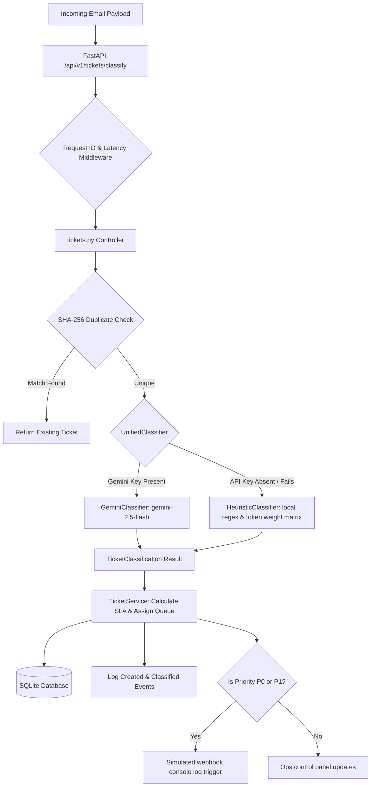
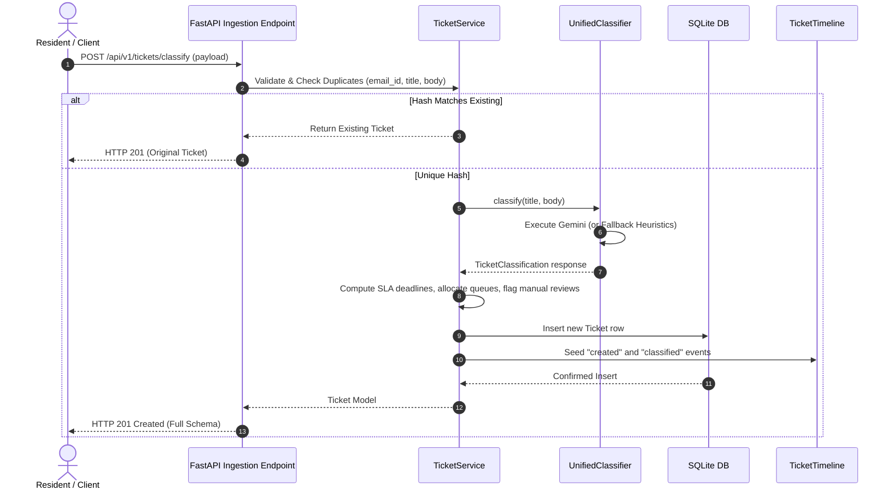
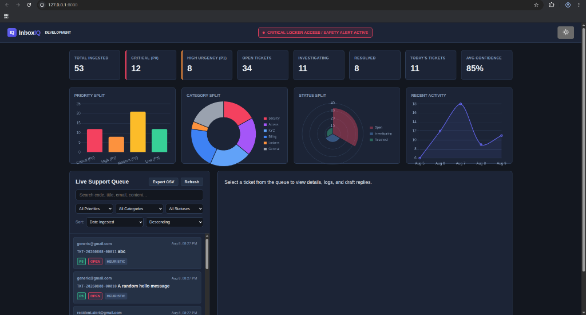
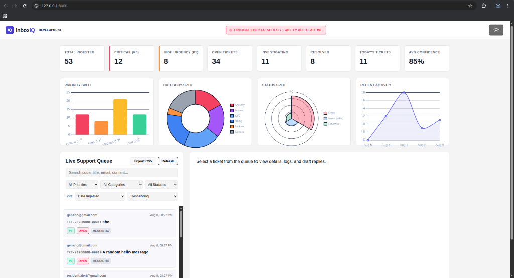

# InboxIQ - Intelligent Ticket Classification & Prioritisation Platform

InboxIQ is a production-grade operations control center and intelligent ticket ingestion API. Designed to support residential secure locker cabinets, it processes incoming emails, routes tickets using a dual-engine classifier (Google Gemini generative AI with schema constraints, or a local weighted heuristics fallback), tracks transition timeline logs, evaluates SLAs, and presents a visual Glassmorphic operations control panel with real-time Chart.js dashboards.

---

## 1. Architecture & Design Decisions

### System Architecture Diagram


### Ingestion Sequence Diagram


---

## 2. Operations Dashboard Interface

The InboxIQ dashboard supports both dark and light modes, responsive queues paging, dynamic Chart.js stats rendering, priority notifications, and manual details overrides.

### Dark Theme Interface


### Light Theme Interface


---

## 3. Key Features

1. **Dual-Engine Classification Routing**: Leverages high-accuracy Google Gemini generative models with hard schema validation constraints. Fallback to local heuristic token weights in under 5 milliseconds if quotas are breached or API keys are absent.
2. **Deterministic Duplicate Protection**: Prevents duplicate submissions by comparing a SHA-256 hash of `email_id + title + body` before running queries or classification.
3. **Audit Trail Timeline Logging**: Keeps a historical record of every ticket event (created, classified, status overrides, priority changes, or agent assignments).
4. **Automated SLA Tracking**: Computes SLA resolution deadlines:
   * **P0 (Critical)**: 15 minutes
   * **P1 (High)**: 2 hours
   * **P2 (Medium)**: 24 hours
   * **P3 (Low)**: 48 hours
5. **Logical Queue Partitioning**: Dynamically partitions incoming queries into specialized operational queues (`Emergency`, `Operations`, `Billing`, `General Support`) to streamline agent routing.
6. **Explainable AI Logging**: Includes full details of classification signals (matched keywords, phrase checks, and weights scoring) so support staff understand why the ticket was classified a certain way.
7. **Human-Friendly Codes**: Formats ticket IDs as `TKT-YYYYMMDD-00001` for easy reference by support staff, while keeping database primary keys internal.
8. **Comprehensive System Health**: Evaluates server status, SQLite query connectivity, Gemini active configurations, uptime, and open counts.
9. **Tabular CSV Exporting**: Supports downloading the current filtered support queue list directly as a CSV spreadsheet.

---

## 4. Directory Layout

```
InboxIQ/
│
├── app/
│   ├── __init__.py
│   ├── main.py              # App config, telemetry middlewares, global routes
│   ├── config.py            # Central settings configurations & logger parameters
│   ├── database.py          # SQLite database connection pool and model mappings
│   ├── schemas.py           # Pydantic validation schemas
│   ├── classifier.py        # Rules keyword matrices and Gemini API endpoints
│   │
│   ├── routes/
│   │     ├── __init__.py
│   │     └── tickets.py     # HTTP routes for tickets, manual overrides, and CSVs
│   │
│   ├── services/
│   │     ├── __init__.py    # Core services (hash check, SLA, codes, audits)
│   │     └── mock_data.py   # Seeder registering 50 mock safe locker records
│   │
│   ├── templates/
│   │     └── dashboard.html # Operations Control Center dashboard layout
│   │
│   └── static/
│         ├── css/
│         │    └── styles.css # Glassmorphism dark/light design system styles
│         └── js/
│              └── app.js    # Queue loaders, overrides triggers, and charts
│
├── requirements.txt         # Package dependencies
├── Dockerfile               # Multi-stage release container setup
├── docker-compose.yml       # One-command orchestration mount
├── postman_collection.json  # Postman collections definitions
├── .env.example             # Template file for local environment configurations
└── run.py                   # Development server bootstrap script
```

---

## 5. Database Schema Specifications

We define two persistent tables inside `app/database.py` with the following properties:

### Table 1: `tickets`
| Column Name | Database Type | Index / PK | Default | Description |
|---|---|---|---|---|
| `id` | `INTEGER` | Primary Key | Auto-increment | Internal tracking identifier |
| `ticket_code` | `VARCHAR(50)` | Unique, Indexed | - | Human-friendly ticket reference (`TKT-YYYYMMDD-00001`) |
| `duplicate_hash` | `VARCHAR(64)` | Indexed | - | SHA-256 fingerprint hash of email content |
| `email_id` | `VARCHAR(255)` | Indexed | - | Submitter email address |
| `title` | `VARCHAR(500)` | - | - | Subject title line |
| `body` | `TEXT` | - | - | Original email body content |
| `category` | `VARCHAR(50)` | Indexed | - | Mapped category (e.g. `security_emergency`, `access_issue`) |
| `priority` | `VARCHAR(10)` | Indexed | - | Priority level (`P0`, `P1`, `P2`, `P3`) |
| `confidence` | `FLOAT` | - | - | Classification confidence (0.00 to 1.00) |
| `status` | `VARCHAR(50)` | Indexed | `"open"` | Ticket resolution state (`open`, `investigating`, `resolved`) |
| `queue_name` | `VARCHAR(50)` | Indexed | `"General Support"` | Allocated queue (`Emergency`, `Operations`, `Billing`, `General Support`) |
| `needs_manual_review`| `BOOLEAN` | - | `False` | True if classification confidence is `< 0.60` |
| `sla_deadline` | `DATETIME` | - | - | Resolution target time |
| `explainable_ai` | `TEXT` | - | - | Detailed text listing of keyword scores and matches |
| `created_at` | `DATETIME` | - | UTC.Now | Ingestion time |
| `updated_at` | `DATETIME` | - | UTC.Now | Last manual override change time |
| `assigned_to` | `VARCHAR(255)` | - | `Null` | Assigned agent |

### Table 2: `ticket_timeline`
| Column Name | Database Type | Index / PK | Default | Description |
|---|---|---|---|---|
| `id` | `INTEGER` | Primary Key | Auto-increment | Timeline event ID |
| `ticket_id` | `INTEGER` | Foreign Key (Cascade) | - | Target ticket ID |
| `event_type` | `VARCHAR(50)` | - | - | Event code (e.g. `created`, `status_changed`, `assigned`) |
| `description` | `TEXT` | - | - | Human-friendly transition log details |
| `created_at` | `DATETIME` | - | UTC.Now | Transition event timestamp |

---

## 6. API Reference

All requests must be prefixed with `/api/v1` except the root dashboard and `/health`.

### 1. Ingest & Classify Email
* **HTTP Method**: `POST`
* **Route**: `/api/v1/tickets/classify`
* **Body (JSON)**:
  ```json
  {
    "email_id": "resident.test@society.com",
    "title": "Jammed locker box 104",
    "body": "I am standing at the kiosk and my biometric scan went green, but box 104 door did not open. Can you assist?"
  }
  ```
* **Sample Response (JSON)**:
  ```json
  {
    "id": 1,
    "ticket_code": "TKT-20260809-00001",
    "email_id": "resident.test@society.com",
    "title": "Jammed locker box 104",
    "body": "I am standing at the kiosk and my biometric scan went green, but box 104 door did not open. Can you assist?",
    "category": "access_issue",
    "priority": "P0",
    "confidence": 0.95,
    "reasoning": "Heuristic classification selected 'access_issue' with confidence 0.95. Weighted score: 8.0.",
    "summary": "Jammed locker box 104",
    "suggested_action": "Initiate remote kiosk diagnostic check. Contact resident to assist...",
    "draft_reply": "Dear Resident, we apologize for the locker access issues...",
    "status": "open",
    "classification_source": "heuristic",
    "needs_manual_review": false,
    "queue_name": "Emergency",
    "sla_deadline": "2026-08-09T02:09:03.123456",
    "explainable_ai": "Weighted Scoring Signals:\n- Keyphrase match 'jammed door' in access_issue: +8.0 score",
    "created_at": "2026-08-09T01:54:03.123456",
    "updated_at": "2026-08-09T01:54:03.123456",
    "assigned_to": null
  }
  ```

### 2. Manual Operational Override
* **HTTP Method**: `PATCH`
* **Route**: `/api/v1/tickets/{id}`
* **Body (JSON)**:
  ```json
  {
    "category": "access_issue",
    "priority": "P1",
    "status": "investigating",
    "assigned_to": "agent_lee"
  }
  ```
* **Sample Response (JSON)**:
  ```json
  {
    "id": 1,
    "ticket_code": "TKT-20260809-00001",
    "category": "access_issue",
    "priority": "P1",
    "status": "investigating",
    "assigned_to": "agent_lee",
    "updated_at": "2026-08-09T01:56:45.654321"
  }
  ```

### 3. Exposing Live System Health
* **HTTP Method**: `GET`
* **Route**: `/health` or `/api/v1/health`
* **Sample Response (JSON)**:
  ```json
  {
    "status": "healthy",
    "database_connected": true,
    "gemini_active": false,
    "heuristic_ready": true,
    "uptime_seconds": 124.52,
    "metrics": {
      "total_tickets": 50,
      "active_critical_alerts": 19
    }
  }
  ```

---

## 7. Local Setup & Execution Guide

### Local Setup
1. **Initialize Virtual Environment**:
   ```bash
   python3 -m venv .venv
   source .venv/bin/activate
   ```
2. **Install Dependencies**:
   ```bash
   pip install -r requirements.txt
   ```
3. **Configure Environment variables**:
   ```bash
   cp .env.example .env
   ```
   Add your Google Gemini API Key inside `.env` to enable AI classification:
   ```env
   GEMINI_API_KEY=your_gemini_api_key_here
   ```
4. **Boot App**:
   ```bash
   python run.py
   ```
   *Note: If no database exists, the platform creates `tickets.db` and seeds 50 locker support tickets cover all categories and priorities.*

### Docker Deployment
Run the entire platform in a Docker container using a secure non-root environment with the following command:
```bash
docker-compose up --build
```
This boots Uvicorn on [http://localhost:8000/](http://localhost:8000/) and mounts a volume so your database changes persist across restarts.

---

## 8. Scaling & Production Enhancements

In high-load environments, implement these architecture modifications:
1. **Asynchronous Processing (Celery & Redis)**: Offload Gemini API requests to Celery workers, allowing the API response thread to respond in under 5ms.
2. **Caching (Redis)**: Cache results for the `/api/v1/analytics/stats` endpoint to avoid running database scanning operations on every page refresh.
3. **Database Migrations (Alembic)**: Use Alembic to modify schemas in production tables cleanly without losing historical data.
4. **Persistent WebSockets**: Shift from AJAX polling to WebSockets to push new tickets and updates to the dashboard instantly.
